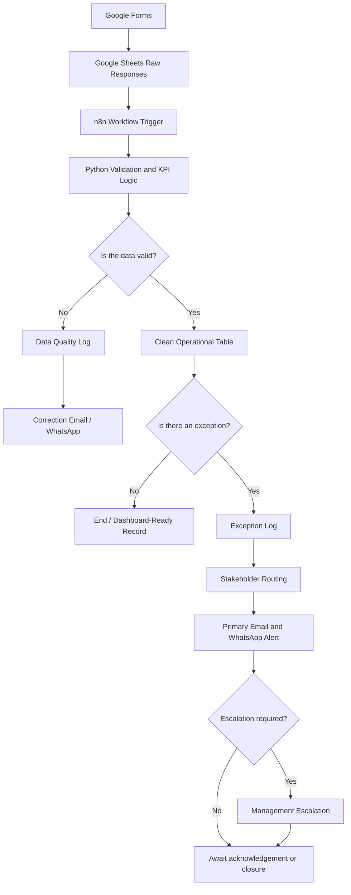

# DCP Digital KPI Automation System

A proof-of-concept digital operations and KPI assurance system designed for cement-production reporting.

The project demonstrates how **Google Forms, Google Sheets, Python, n8n, Gmail and WhatsApp** can be combined to collect operational data, validate submissions, calculate production KPIs, identify exceptions, route incidents to the correct stakeholders and support timely escalation.

> **Important:** This is an independent competition/portfolio project. It is not an official Dangote Cement Plc system, and the datasets, thresholds, contacts and operating assumptions used are simulated for demonstration purposes.

---

## Project Objective

The aim is to move operational reporting from a largely manual process into a structured workflow that can:

- capture daily production and downtime information;
- validate incoming data before it enters the clean reporting tables;
- calculate operational KPIs automatically;
- identify production, availability and data-quality exceptions;
- assign severity levels;
- route alerts to the responsible team;
- notify stakeholders through email and WhatsApp;
- escalate high- and critical-severity incidents;
- create clean, dashboard-ready datasets; and
- preserve an auditable record of incidents and responses.

---

## Live Project Resources

### Complete project folder

[Open the DCP Automation folder in Google Drive](https://drive.google.com/drive/folders/1ezMgMEV_0QFHnxq52cVs2DDp1ypmnxJT?usp=drive_link)

### Data-capture forms

- [Daily Production Submission Form](https://forms.gle/E8NQqvsnTQ91xURM7)
- [Downtime Incident Report Form](https://forms.gle/VhrgdXPfsT35UrES8)
- [Exception Identification Form](https://forms.gle/iG3mjNwds8wYkWAS9)

---

## Solution Architecture



The system uses Google Forms for data capture, Google Sheets as the operational data store, Python for KPI and validation logic, and n8n as the orchestration layer.

---

## Implemented Workflows

## 1. Daily Production Automation

The Daily Production workflow processes one production record for a plant, production line and reporting date.

### Workflow sequence

```text
Daily Production Form
        ↓
Google Sheets Trigger
        ↓
Python KPI Calculation and Validation
        ↓
Is Data Valid?
      ↙             ↘
Invalid             Valid
   ↓                  ↓
Data Quality Log   Daily Production Clean
   ↓                  ↓
Correction Alert   Is Production Exception?
                         ↙          ↘
                        No          Yes
                        ↓            ↓
                       End      Exception Log
                                      ↓
                              Email / WhatsApp Alert
```

### Main calculations

#### Production Achievement

```text
Production Achievement (%) =
Cement Actual Output ÷ Cement Target × 100
```

#### Production Variance

```text
Production Variance =
Cement Actual Output − Cement Target
```

#### Clinker Achievement

```text
Clinker Achievement (%) =
Clinker Actual Output ÷ Clinker Target × 100
```

#### Packing Gap

```text
Packing Gap =
Cement Actual Output − Packing Actual Output
```

### Main outputs

- Daily Production ID
- Clinker Achievement %
- Production Achievement %
- Production Variance
- Packing Gap
- Validation Result
- Data Quality Score
- Exception Flag
- Severity
- Alert ID
- Exception Status

The workflow stores valid records in a clean production table. Invalid records are redirected to the Data Quality Log and the respondent is notified to correct the submission.

---

## 2. Downtime Incident Automation

The Downtime Incident workflow processes equipment or process interruptions, calculates availability, classifies the incident and routes the alert to the responsible stakeholder.

### Workflow sequence

```text
Downtime Incident Form
        ↓
Google Sheets Trigger
        ↓
Python Downtime Calculation and Validation
        ↓
Is Downtime Data Valid?
      ↙                     ↘
Invalid                     Valid
   ↓                          ↓
Data Quality Log         Downtime Clean
   ↓                          ↓
Correction Alert         Is Downtime Exception?
                               ↙          ↘
                              No          Yes
                              ↓            ↓
                             End      Exception Log
                                            ↓
                                   Stakeholder Routing
                                            ↓
                                  Was Stakeholder Found?
                                      ↙            ↘
                                     No            Yes
                                     ↓              ↓
                              Supervisor Alert   Primary Alert
                                                     ↓
                                          Is Escalation Required?
                                              ↙            ↘
                                             No            Yes
                                             ↓              ↓
                                            End      Escalation Alert
```

### Main calculations

#### Elapsed Downtime

```text
Elapsed Downtime =
Downtime End Date/Time − Downtime Start Date/Time
```

For an ongoing incident, the form-submission timestamp is temporarily used as the measurement end time and the metric is marked **Provisional**.

#### KPI Downtime

```text
KPI Downtime =
Minimum of Elapsed Downtime and Planned Runtime
```

This prevents availability from becoming negative when an incident runs longer than the planned operating period.

#### Actual Runtime

```text
Actual Runtime =
Planned Runtime − KPI Downtime
```

#### Availability

```text
Availability (%) =
Actual Runtime ÷ Planned Runtime × 100
```

### Main outputs

- Downtime ID
- Alert ID
- Elapsed Downtime Hours
- KPI Downtime Hours
- Actual Runtime Hours
- Availability %
- Metric Status
- Validation Result
- Data Quality Score
- Calculated Severity
- Exception Flag
- Exception Type
- Exception Reasons
- Escalation Required
- Routing Key
- Required Action

### Stakeholder routing

The workflow creates a routing key using:

```text
Plant ID | Responsible Area
```

Example:

```text
IBS|Electrical Team
```

n8n searches the stakeholder-routing table for the matching record and retrieves:

- primary contact;
- primary email;
- primary WhatsApp number;
- escalation contact;
- escalation email; and
- escalation WhatsApp number.

If no stakeholder match is found, the alert falls back to the supervisor or respondent email.

### Multi-channel notifications

The workflow supports:

- primary Gmail alert;
- primary WhatsApp alert;
- supervisor fallback alert;
- high- or critical-severity escalation email; and
- high- or critical-severity escalation WhatsApp alert.

---

## 3. Exception Identification and Closure

The Exception Identification Form is designed to support the acknowledgement, investigation, escalation, resolution and closure of an existing alert.

The intended workflow uses the generated **Alert ID** to locate the original exception and update its status.

### Intended lifecycle

```text
Open
  ↓
Acknowledged
  ↓
In Progress
  ↓
Monitoring
  ↓
Resolved
  ↓
Closed
```

Possible outcomes include:

- acknowledge the alert;
- submit a progress update;
- record the confirmed root cause;
- document corrective action;
- escalate the incident;
- submit restoration details;
- continue monitoring; or
- close the alert.

The form has been created and is included in the project resources. Full workflow automation for exception closure is the next implementation stage.

---

## Data Quality Framework

The system does not allow invalid operational records to enter the clean reporting tables.

Typical validation checks include:

- required field checks;
- valid plant and production-line values;
- numeric target and actual-output checks;
- non-negative production values;
- planned runtime between 0 and 24 hours;
- restored incidents requiring an end date and end time;
- end time not preceding start time;
- non-negative estimated output loss; and
- valid notification email.

Invalid records are written to the **Data Quality Log** with:

- source;
- record ID;
- validation result;
- validation issues;
- data quality score;
- severity;
- reporting date; and
- notification recipient.

> The Data Quality Score and severity thresholds are project assumptions created for the proof of concept. They are not official DCP standards.

---

## Exception and Severity Logic

The system evaluates incidents using operational conditions such as:

- production achievement below the accepted threshold;
- unplanned downtime;
- availability below the accepted threshold;
- production interruption;
- entire-line impact;
- estimated output loss;
- ongoing incident status; and
- initial operational priority.

Typical classifications are:

| Severity | General meaning |
|---|---|
| Normal / Low | No immediate operational concern |
| Medium | Performance deviation requiring attention |
| High | Significant operational impact requiring rapid response |
| Critical | Severe production or availability impact requiring escalation |
| Data Quality Error | Record cannot be trusted until corrected |

High and Critical incidents are escalated to the configured management contact.

---

## Data Model

The proof of concept is organised around the following logical tables:

### Raw response tables

- Daily Production Form Responses
- Downtime Incident Form Responses
- Exception Identification Form Responses

### Clean operational tables

- Daily Production Clean
- Downtime Clean

### Control and audit tables

- Data Quality Log
- Exception Log
- Stakeholder Routing
- Exception Closure Log
- Notification Log

### Supporting datasets

- Plant Master
- Qualitative Exception Logic
- Simulated Daily Production Data
- Simulated Downtime Data
- Simulated Data Quality Records

---

## Repository Structure

```text
DCP-Digital-KPI-Automation/
│
├── Work Images/
│   ├── workflow screenshots
│   ├── form screenshots
│   └── implementation evidence
│
├── DCP_data_.xlsx
│   └── simulated operational data prepared for KPI analysis
│       and dashboard development
│
├── Qualitative_Exception_Logic_.xlsx
│   └── process risks, exception conditions, responsible teams,
│       escalation levels and recommended actions
│
├── DCP_Google_Forms_n8n_Automation_Blueprint.pdf
│   └── implementation blueprint for Google Forms, Google Sheets
│       and n8n workflow automation
│
├── LICENSE
│
└── README.md
```

---

## Technology Stack

| Tool | Purpose |
|---|---|
| Google Forms | Operational data capture |
| Google Sheets | Raw, clean and control-table storage |
| n8n Cloud | Workflow orchestration |
| Python | Validation, KPI calculations and exception logic |
| Gmail | Email notifications and escalation |
| WhatsApp Business Cloud | Real-time stakeholder alerts |
| Microsoft Excel | Simulated datasets and dashboard preparation |
| Power BI | Planned KPI dashboard and management reporting layer |
| GitHub | Version control and project documentation |

---

## Current Project Status

| Component | Status |
|---|---|
| Daily Production Form | Completed |
| Daily Production n8n Workflow | Completed and tested |
| Production KPI Calculations | Completed |
| Production Data Validation | Completed |
| Production Exception Logging | Completed |
| Downtime Incident Form | Completed |
| Downtime n8n Workflow | Completed and tested |
| Downtime Availability Calculation | Completed |
| Stakeholder Routing | Implemented |
| Gmail Notifications | Implemented |
| WhatsApp Notifications | Implemented |
| Severity-Based Escalation | Implemented |
| Exception Identification Form | Completed |
| Exception Closure Workflow | Next phase |
| Dashboard-Ready Simulated Data | Prepared |
| Power BI Dashboard | Next phase |

---

## Testing Scenarios

The workflows were designed to test cases such as:

### Daily Production

- normal production above target;
- production below the exception threshold;
- zero or missing target;
- provisional production values;
- interrupted production; and
- invalid or incomplete submissions.

### Downtime

- minor planned downtime;
- restored unplanned incident;
- ongoing downtime;
- incident crossing midnight;
- entire production-line impact;
- high estimated output loss;
- missing end date or time; and
- missing stakeholder-routing match.

Each test checks whether the record is:

- accepted or rejected;
- written to the correct table;
- classified correctly;
- assigned the correct severity;
- routed to the correct stakeholder; and
- sent through the appropriate notification channel.

---

## How to Reproduce the Solution

1. Create the three Google Forms using the project blueprint.
2. Link each form to the central Google Sheets workbook.
3. Create the clean, exception, routing and data-quality tabs.
4. Import or rebuild the n8n workflows.
5. Connect Google Sheets credentials.
6. Add the Python validation and KPI-calculation nodes.
7. Configure IF nodes for validation and exception routing.
8. Connect Gmail and WhatsApp Business Cloud credentials.
9. Populate the Stakeholder Routing sheet.
10. Submit test records through the forms.
11. Confirm that the expected rows and alerts are generated.
12. Publish the workflows after successful testing.

Do not leave blank rows at the top of the response sheets. A blank first row may be processed as an empty item and cause downstream email or routing fields to resolve as blank.

---

## Key Design Decisions

### Separate raw and clean data

Form responses remain untouched as the raw audit trail. Only validated records are copied into clean reporting tables.

### Separate workflows by business process

Daily Production, Downtime Incident and Exception Closure are handled as separate workflows. This makes each workflow easier to test, maintain and explain.

### Python for business logic

Python performs calculations and rule evaluation because it keeps the KPI logic transparent and easy to audit.

### n8n for orchestration

n8n handles triggers, branching, Google Sheets operations, stakeholder lookup, email, WhatsApp and escalation.

### Multi-channel alerts

Operational exceptions should not depend on a single communication channel. Email provides the detailed record, while WhatsApp supports faster visibility.

---

## Known Limitations

- The project uses simulated data rather than live DCP production systems.
- Thresholds and severity rules are assumed for demonstration.
- Google Forms relies on manual submission and is not a replacement for direct SCADA, PLC, historian or ERP integration.
- WhatsApp delivery depends on valid Meta credentials, approved templates and recipient configuration.
- The exception closure workflow is not yet fully automated.
- The Power BI dashboard is planned but not included as a completed deliverable at this stage.

---

## Recommended Production-Scale Architecture

For a real industrial deployment, Google Forms could be replaced or supplemented by direct integrations with:

- SCADA;
- PLCs;
- plant historians;
- SAP or another ERP;
- maintenance-management systems;
- laboratory systems;
- SQL databases;
- Microsoft Teams;
- Outlook; and
- Power BI.

The same exception, routing and escalation principles could then operate on near-real-time plant data.

---

## Project Value

This project demonstrates how operational reporting can move beyond static spreadsheets into an automated decision-support system.

The value is not only in calculating KPIs. It is in creating a complete operational chain:

```text
Data Capture
    ↓
Data Validation
    ↓
KPI Calculation
    ↓
Exception Detection
    ↓
Stakeholder Ownership
    ↓
Notification
    ↓
Escalation
    ↓
Resolution
    ↓
Management Reporting
```

The result is a more traceable, responsive and automation-ready approach to production performance and data quality.

---

## Author

**Oluwatobi Victor-Banjo**

Digital transformation, analytics and business-process automation project.

---

## Disclaimer

This repository is an independent educational and portfolio project. The use of the name “DCP” and references to cement-production operations are for demonstration and competition purposes only. No claim is made that the solution, data, thresholds or processes represent an official internal system of Dangote Cement Plc.
